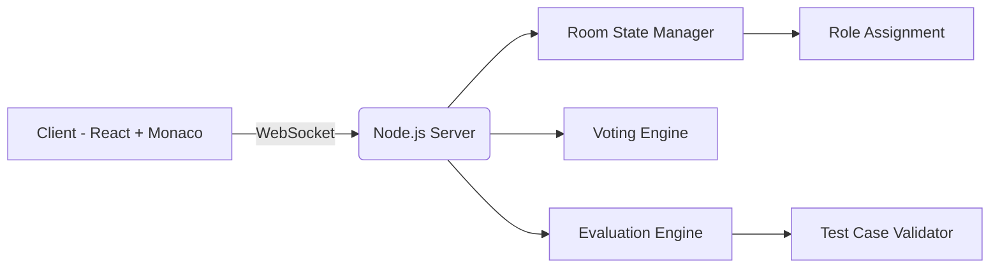

# 👾 Code Phantom  
### Find the Bug. Find the Imposter.

<p align="center">
  
  
  
</p>

---

## 🚀 What is Code Phantom?

**Code Phantom** is a multiplayer coding battlefield that combines:

- 🧠 **Data Structures & Algorithms**
- 🎭 **Social Deduction (Among Us-style mechanics)**
- ⚡ **Real-time Collaborative Coding**

It transforms isolated coding grind into a competitive, strategic, adrenaline-filled team sport.

---

# 📖 Table of Contents

- [⚡ The Problem vs. The Solution](#-the-problem-vs-the-solution)
- [🎮 How to Play](#-how-to-play-core-gameplay-loop)
- [🏆 Competitive Advantage](#-competitive-advantage)
- [🛠 Tech Stack](#-tech-stack)
- [🏗 Architecture Overview](#-architecture-overview)
- [🎥 Demo](#-demo)
- [🚀 Future Roadmap](#-future-roadmap)
- [💻 Getting Started](#-getting-started)
- [📜 License](#-license)

---

# ⚡ The Problem vs. The Solution

## ❌ The Problem

- Coding practice is **isolated and repetitive**
- No real experience in **debugging other people's code**
- Hard to stay motivated long-term
- Limited teamwork in DSA preparation

## ✅ The Solution

- Multiplayer live coding rooms
- Secret imposter injecting bugs
- Real-time code review & voting
- Competitive, gamified problem-solving

---

# 🎮 How to Play (Core Gameplay Loop)

At the start of every match, players are secretly assigned a role.

## 🧑‍💻 Civilians

- Collaborate in a shared editor
- Implement the optimal algorithm
- Pass all test cases
- Detect sabotage
- Call emergency meetings
- Vote out the Imposter

## 🦹 Imposter

- Secretly sabotage the code
- Inject logical bugs
- Reverse loops
- Change conditions subtly
- Survive meetings
- Run down the timer or eliminate Civilians

---

# 🏆 Competitive Advantage

| Feature | Code Phantom | Replit | Codingame | HackerRank |
|----------|--------------|--------|------------|------------|
| Live Shared Editor | ✅ | ✅ | ❌ | ❌ |
| Multiplayer Competition | ✅ | ❌ | ✅ | ✅ |
| Social Deduction | ✅ | ❌ | ❌ | ❌ |
| Role-Based Gameplay | ✅ | ❌ | ❌ | ❌ |
| Real-time Sabotage | ✅ | ❌ | ❌ | ❌ |

> Code Phantom is the **first platform** to combine social deduction with live algorithmic collaboration.

---

# 🛠 Tech Stack

## 🧠 Backend
<p>
  
  
</p>

- Room state management
- Role assignment logic
- Voting system
- WebSocket synchronization

---

## 🎨 Frontend
<p>
  
  
  
</p>

- Real-time collaborative editor
- Smooth UI animations
- VS Code-like coding experience

---

# 🏗 Architecture Overview



## 🚀 Future Roadmap

- [ ] **RANKED AND STREAK SYSTEM**  
  Introducing a secure login system to create player profile and track performance. A ranked system with rating points, leaderboards and tire level can be added to encourage competitive gameplay.

- [ ] **WebRTC Integration**  
  Add spatial voice chat for emergency meetings and strategy discussions.

- [ ] **3D Interactive Lobbies**  
  Use Three.js to create immersive, interactive 3D meeting rooms.

---

## 💻 Getting Started

### Prerequisites

- Node.js (v16+)
- npm or yarn

---

### Installation & Run

# 📦 CLONE PROJECT

```bash
git clone https://github.com/yourusername/code-phantom.git
cd code-phantom
```

# 📥 INSTALL DEPENDENCIES

Install server dependencies
```bash
cd server
npm install
```
Install client dependencies
```bash
cd ../client
npm install
```

# 🚀 START DEVELOPMENT SERVERS

Terminal 1 - Start Backend
```bash
cd server
npm run dev
```

Terminal 2 - Start Frontend
```bash
cd client
npm start
```

# 🌐 OPEN IN BROWSER

```bash
http://localhost:5173
```
